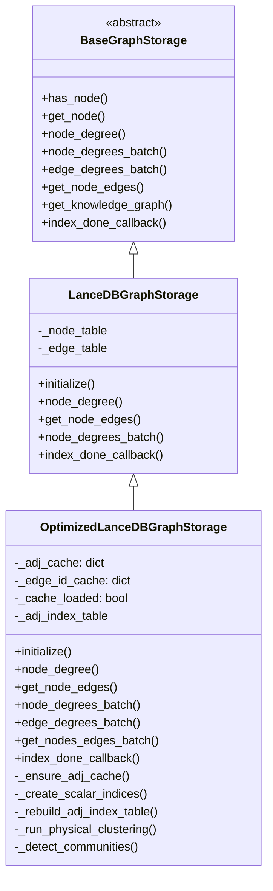

# LanceDB 图存储优化层实施计划

## 架构设计




## 涉及文件

- [lightrag/kg/lancedb_impl.py](lightrag/kg/lancedb_impl.py) -- 唯一改动：第 752 行移除 `@final` 装饰器
- **lightrag/kg/lancedb_graph_optimizer.py** -- 新文件，全部优化逻辑
- [lightrag/kg/**init**.py](lightrag/kg/__init__.py) -- 注册新类名

## 对 lancedb_impl.py 的唯一改动

第 752 行，移除 `@final`：

```python
# 前
@final
@dataclass
class LanceDBGraphStorage(BaseGraphStorage):

# 后
@dataclass
class LanceDBGraphStorage(BaseGraphStorage):
```

其余代码不做任何修改。

---

## 新文件 `lancedb_graph_optimizer.py` 结构

按功能分为五个 Section：

### Section 1: 标量索引管理

在 `initialize()` 中调用，为边表的 `source_node_id`、`target_node_id`、`_id` 创建 BTree 索引，为节点表的 `_id` 创建 BTree 索引。

- 方法: `_create_scalar_indices()`
- 时机: `initialize()` 中 `super().initialize()` 之后
- 幂等处理: 用 try/except 包裹，索引已存在时静默跳过
- 空表保护: 表行数为 0 时跳过索引创建（LanceDB 要求有数据）

### Section 2: 内存邻接缓存

核心数据结构：

```python
_adj_cache: dict[str, set[str]]      # node_id -> {neighbor_ids}
_edge_id_cache: dict[str, set[str]]  # node_id -> {edge_ids}
_degree_cache: dict[str, int]        # node_id -> degree
_cache_loaded: bool = False
```

- 方法: `_ensure_adj_cache()` -- 懒加载，首次调用时全表扫描边表（只取 `_id`, `source_node_id`, `target_node_id` 三列）构建缓存
- 方法: `_invalidate_adj_cache()` -- 清空缓存，下次查询时重建
- 覆盖: `node_degree()` -- 缓存就绪时直接 `len(self._adj_cache[node_id])`，否则 `super()`
- 覆盖: `get_node_edges()` -- 缓存就绪时从 `_adj_cache` 构造返回值
- 覆盖: `node_degrees_batch()` -- 缓存就绪时批量读缓存
- 覆盖: `get_nodes_edges_batch()` -- 缓存就绪时批量读缓存
- 覆盖: `edge_degrees_batch()` -- 收集所有唯一节点 -> `node_degrees_batch()` -> 组合结果

### Section 3: 邻接索引表（磁盘持久化，大图场景可选）

表名: `{namespace}_adj_idx`

Schema:

```python
KG_ADJ_INDEX_SCHEMA = pa.schema([
    pa.field("entity_id", pa.utf8(), nullable=False),
    pa.field("next_hop_id", pa.utf8()),
    pa.field("edge_id", pa.utf8()),
    pa.field("edge_row_id", pa.int64()),
    pa.field("node_row_id", pa.int64()),
    pa.field("weight", pa.float64()),
])
```

- 方法: `_rebuild_adj_index_table()` -- 在 `index_done_callback()` 中调用
  1. 全表扫描边表，保留 `_rowid`
  2. 全表扫描节点表，建立 `node_id -> _rowid` 映射
  3. 对每条边生成 2 行（双向）
  4. 用 overwrite 模式写入邻接索引表
  5. 为 `entity_id` 列创建 BTree 索引
- 默认关闭，通过构造参数 `enable_adj_index_table=False` 控制

### Section 4: 物理聚簇优化

- 方法: `_detect_communities(edges)` -- 社区检测
  - 默认: Connected Components（纯 Python，无外部依赖）
  - 可选: Louvain（需 networkx，通过参数 `clustering_algorithm="connected_components"` 切换）
  - 输入: 边列表 `[(src, tgt), ...]`
  - 输出: `dict[str, int]` -- `node_id -> community_label`
- 方法: `_run_physical_clustering()` -- 物理重排
  1. 调用 `_detect_communities()` 获取社区标签
  2. 给每条边分配社区：两端同社区则属该社区，跨社区则归入两端中较大社区
  3. 边表：按 `(community_label, source_node_id)` 排序后 overwrite 重写
  4. 节点表：按 `community_label` 排序后 overwrite 重写
  5. 重建标量索引（因 row_id 全部变化）
  6. 重建邻接索引表（如果启用）
- 触发时机: `index_done_callback()` 中，在邻接缓存重建之后
- 默认关闭，通过构造参数 `enable_physical_clustering=False` 控制
- 保护: 边数小于阈值（如 100）时跳过，避免小图做无意义重排

**重写流程**（以边表为例）:

```python
async def _rewrite_table_sorted(self, table, data_sorted, schema, table_name):
    """用排序后的数据 overwrite 整张表"""
    # 1. 将排序后的 PyArrow Table 写入新的 Lance dataset
    import lance
    uri = os.environ.get("LANCEDB_URI", "./lancedb")
    ds_path = f"{uri}/{table_name}.lance"
    lance.write_dataset(data_sorted, ds_path, mode="overwrite")
    # 2. 重新打开表
    return await self.db.open_table(table_name)
```

### Section 5: 生命周期管理

覆盖三个关键生命周期方法：

```python
async def initialize(self):
    await super().initialize()
    # 创建标量索引
    await self._create_scalar_indices()
    # 创建邻接索引表（如果启用）
    if self._enable_adj_index_table:
        self._adj_index_table = await get_or_create_table(...)

async def index_done_callback(self):
    await super().index_done_callback()
    # 1. 物理聚簇（如果启用）
    if self._enable_physical_clustering:
        await self._run_physical_clustering()
    # 2. 重建邻接索引表（如果启用）
    if self._enable_adj_index_table:
        await self._rebuild_adj_index_table()
    # 3. 刷新内存邻接缓存
    self._invalidate_adj_cache()

async def finalize(self):
    self._invalidate_adj_cache()
    await super().finalize()
```

---

## **init**.py 注册

在 `STORAGE_IMPLEMENTATIONS`、`STORAGES`、`STORAGE_ENV_REQUIREMENTS` 中新增：

```python
# STORAGE_IMPLEMENTATIONS["GRAPH_STORAGE"]["implementations"] 追加
"OptimizedLanceDBGraphStorage"

# STORAGES 新增
"OptimizedLanceDBGraphStorage": ".kg.lancedb_graph_optimizer"

# STORAGE_ENV_REQUIREMENTS 新增
"OptimizedLanceDBGraphStorage": []
```

---

## 配置参数设计

`OptimizedLanceDBGraphStorage` 通过 `graph_storage_cls_kwargs` 接受配置：

```python
rag = LightRAG(
    graph_storage="OptimizedLanceDBGraphStorage",
    graph_storage_cls_kwargs={
        "enable_adj_index_table": False,      # 邻接索引表（磁盘），默认关闭
        "enable_physical_clustering": False,   # 物理聚簇，默认关闭
        "clustering_algorithm": "connected_components",  # 或 "louvain"
        "clustering_min_edges": 100,          # 边数低于此值不做聚簇
    }
)
```

默认仅启用内存邻接缓存 + 标量索引 + edge_degrees_batch 覆盖（零配置即有收益）。

---

## 实施顺序

每个 todo 可独立测试验证后再进入下一步。
